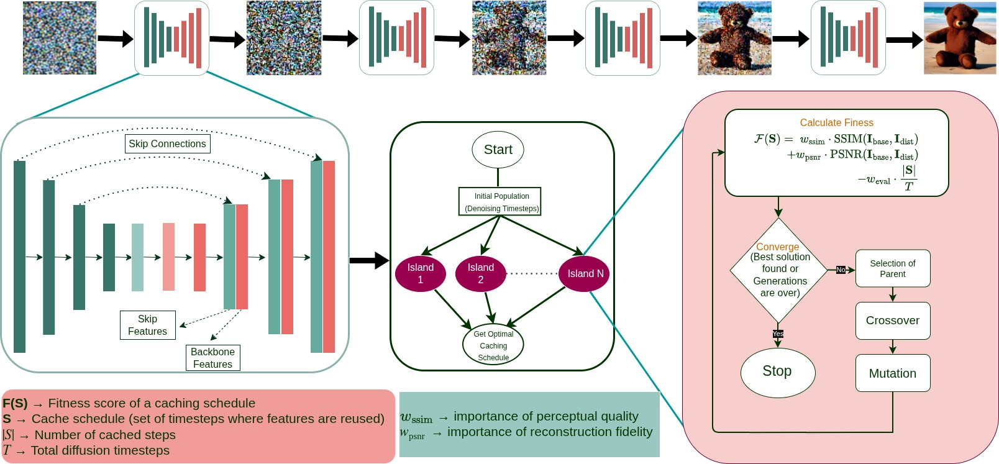

# Genesis
---
## 📖 INTRODUCTION

#### This repository contains official implementation of Genesis: Evolving Optimal Cache Schedule for Diffusion Models paper.
#### This introduces Island model based searching algorithm specifically designed to explore the complex search space of caching schedules.

---
## 🗝️ Environment <br>
#### Create and activate a suitable conda environment named deep by using the following commands:
```bash
cd Genesis
conda env create -f environment.yaml
conda activate deep
```
## 📕 Data <br>
#### Please download all original datasets used for evaluation from each dataset’s official website.
---
## 🔧 Example Usage
```bash
python generate.py --prompt "write prompt here"
```
